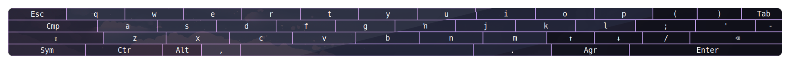
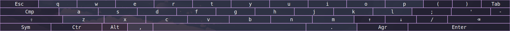
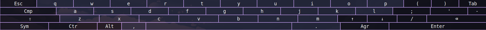
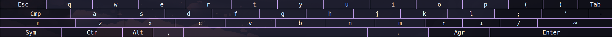

<h3 align="center">
	 
	
	Catppuccin for <a href="https://github.com/jjsullivan5196/wvkbd">wvkbd</a>
	
</h3>

	
	
	

	

## Previews

🪴 Frappé

🌺 Macchiato

🌿 Mocha

## Usage

1. Replace the color scheme in your config.h with one from one of these folders:

- [Frappe](./themes/frappe/)
- [Macchiato](./themes/macchiato/)
- [Mocha](./themes/mocha/)

2. Compile wvkbd.

## 💝 Thanks to

- [Iván Ruzo](https://github.com/iruzo)

&nbsp;

	

	Copyright &copy; 2021-present <a href="https://github.com/catppuccin" target="_blank">Catppuccin Org</a>

	

